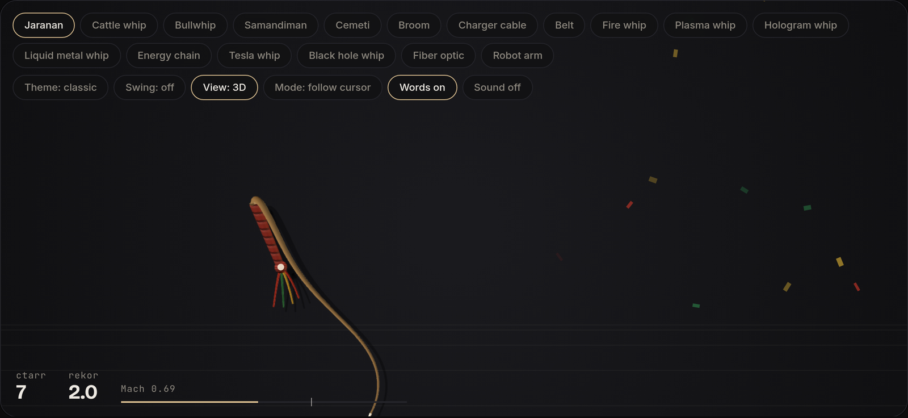
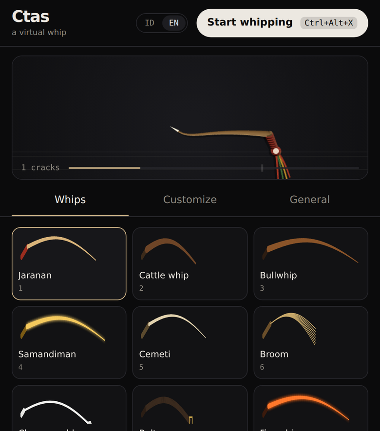
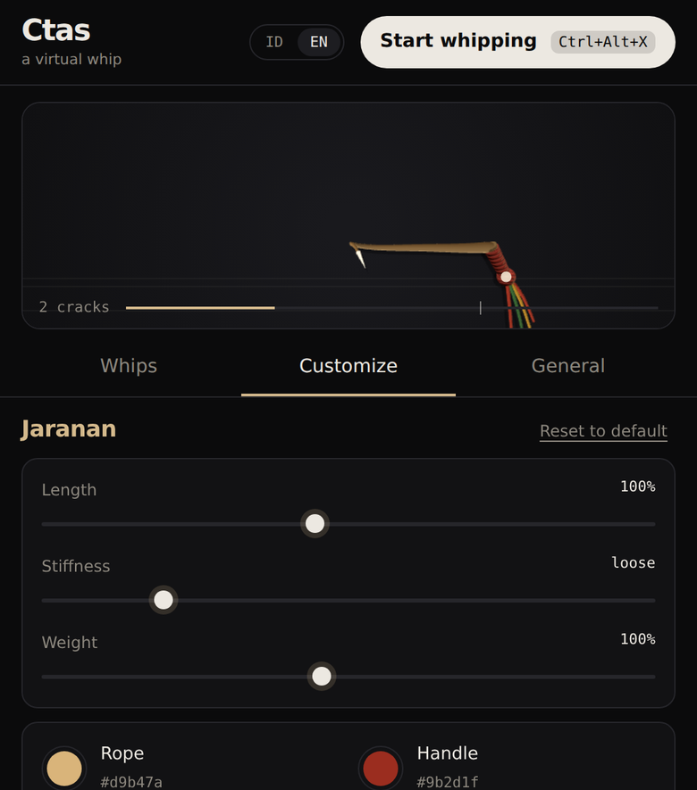

# Ctas

A virtual whip for your screen. Swing the mouse, flick it, crack. Runs on macOS, Windows, and Linux.

**[Download](https://github.com/nannndev/ctass/releases/latest)** · **[Try it in the browser](https://ctass.vercel.app)** · Free



<p>
  
  
</p>

## Usage

1. Open Ctas, pick a whip, and click **Start whipping**.
2. Swing the mouse and suddenly reverse direction. Crack.
3. To stop, press **⌘⇧X** (Mac), **Ctrl+Alt+X** (Windows, Linux), or Esc.

The overlay is click-through, so you can keep using your screen as usual. The Ctas window lives in the menu bar / system tray.

## Install

| OS | File |
| --- | --- |
| macOS 11+ | `Ctas-macOS.dmg` |
| Windows 10/11 | `Ctas-Windows-setup.exe` |
| Linux x64 (X11) | `Ctas-Linux.AppImage` / `.deb` |

- **macOS:** if it says the app is "damaged", run `xattr -cr /Applications/Ctas.app`.
- **Windows:** if SmartScreen appears, click **More info → Run anyway**.

Once installed, updates arrive automatically from inside the app.

## Development

Requires Node 22+ and stable Rust.

```sh
npm install
npm run dev   # desktop app
npm run web   # landing page at localhost:3000
```

To release, bump `version` in `src-tauri/tauri.conf.json` and push to `main`. CI builds the installers and publishes the release.

## Credits

Whip crack and swing recordings from [Pixabay](https://pixabay.com) (Universfield, freesound_community).
